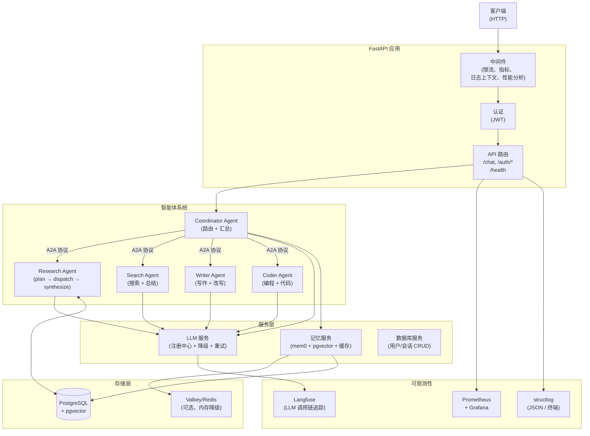
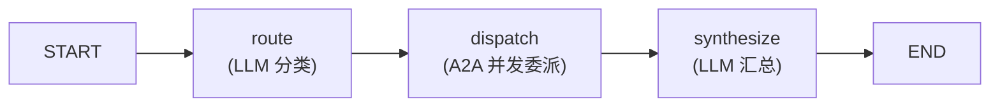
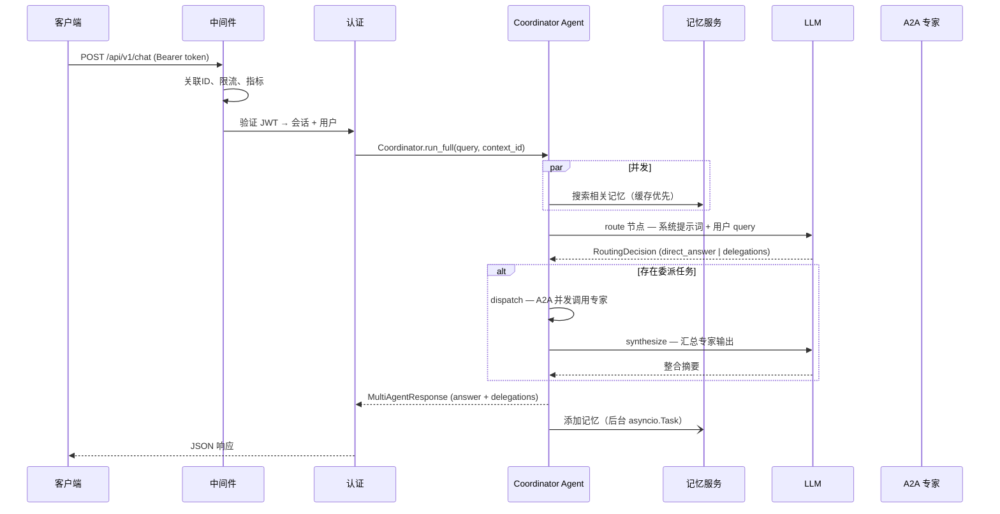

# 架构文档

## 系统总览

## 五大 Agent

每个 Agent 是 `app/agents/<name>/` 下自包含的 LangGraph 包，通过统一的 `Agent` 协议暴露 `run(task, context_id) -> str` 协程。`AGENT_REGISTRY` 在启动时延迟加载所有 Agent，`app/main.py` 的 lifespan 负责预编译各自的 LangGraph 图。

### Agent 清单

| Agent | 类型 | A2A 角色 | 说明 |
|---|---|---|---|---|
| `coordinator` | 路由器 | A2A 客户端 | LLM 将用户请求分类为委派任务或直接回答，通过 A2A 协议并发派发到专家 Agent，最后汇总合成最终回答 |
| `research` | 专家 | A2A 服务器 | 深度研究：三节点 LangGraph（plan → dispatch → synthesize），并发执行多个子任务后输出带引用的 Markdown 报告 |
| `search` | 专家 | A2A 服务器 | 网页搜索：调用 Tavily API 搜索并总结为简洁的事实性答案 |
| `writer` | 专家 | A2A 服务器 | 写作/改写：对输入文本进行润色、改写、翻译或格式化 |
| `coder` | 专家 | A2A 服务器 | 编程助手：回答编程问题、生成代码片段 |

**核心设计**：

- **每个 Agent 自带提示词**：`prompts/` 子目录下的 `.md` 文件，通过 `app/agents/base.py` 的 `load_prompt()` 加载。
- **每个 Agent 自带 AgentCard**：供 A2A 协议发现的 `card.py`，描述该 Agent 的能力和 endpoint。
- **Coordinator 是唯一用户入口**：`POST /api/v1/chat` 将请求交给 Coordinator，Coordinator 路由到 4 个专家后再汇总。
- **Research Agent 持久化**：拥有独立的 PostgreSQL 连接池用于 LangGraph 检查点，支持中断恢复。其余 4 个 Agent 均为无状态。

## 两大智能体系统

应用内运行着两套智能体系统，通过 A2A 协议协作：

### 1. Coordinator Agent —— 用户入口 (`app/agents/coordinator/`)

所有用户请求的唯一入口（`POST /api/v1/chat`）。Coordinator 是一个 LangGraph Agent，其 graph 分为三个阶段：

- **`route`** — LLM 将用户请求分类：直接回答（简单问题）或委派列表（需专家处理的复杂任务）。
- **`dispatch`** — 将委派任务通过 A2A 协议并发发往 4 个专家（research/search/writer/coder），受 `A2A_COORDINATOR_MAX_PARALLEL` 信号量限制。
- **`synthesize`** — LLM 生成简短整合摘要，然后将各专家输出原文追加在对应标题下（避免 LLM 复述时丢失细节）。

### 2. 四个 Specialist Agent —— A2A 专家服务器

每个 Specialist 是独立的 A2A 服务器，拥有自己的 AgentCard、LangGraph 图和提示词，通过 `mount_a2a_servers()` 挂载为 FastAPI 子应用：

| Agent | 文件 | 能力 |
|---|---|---|
| **Research** | `app/agents/research/` | 深度研究：三节点 graph（plan → dispatch → synthesize），并发子任务 + Tavily 搜索，输出带引用的 Markdown 报告。拥有独立 PostgreSQL 检查点连接池 |
| **Search** | `app/agents/search/` | 网页搜索：调用 Tavily API，LLM 总结为简洁事实性答案 |
| **Writer** | `app/agents/writer/` | 写作/改写/翻译：对输入文本进行润色和格式化 |
| **Coder** | `app/agents/coder/` | 编程助手：回答编程问题、生成代码片段 |

**A2A 通信流**：Coordinator 通过 `a2a_specialist_client`（共享 `httpx.AsyncClient` 连接池）调用各专家。每个专家是独立的 FastAPI 子应用，拥有自己的 `DefaultRequestHandler` + `InMemoryTaskStore`。Coordinator 是 A2A 客户端，4 个专家是 A2A 服务器。

## 请求生命周期

## 关键设计决策

**五大 Agent 共享 LLM 服务但独立初始化。** 每个 Agent 拥有独立的 LangGraph 图、独立的提示词和独立的预热流程。仅 Research Agent 拥有 PostgreSQL 检查点连接池（用于持久化研究中间状态），其余 4 个均为无状态。一个 Agent 启动失败不会阻止其他 Agent 启动（优雅降级）。

**Coordinator 是唯一用户入口，通过 A2A 协议路由到专家。** `POST /api/v1/chat` 将请求交给 Coordinator，Coordinator 通过 A2A 协议并发派发到 4 个专家，然后 LLM 生成简短整合摘要，专家原文作为主回答。每个专家拥有自己的 AgentCard（`app/agents/<name>/card.py`）描述能力。

**A2A 专家是独立的 FastAPI 子应用。** 每个专家作为独立的 A2A 服务器挂载，拥有自己的 `DefaultRequestHandler`、`SpecialistAgentExecutor` 和 `InMemoryTaskStore`。Coordinator 通过 `a2a_specialist_client`（共享 `httpx.AsyncClient` 连接池）调用它们。

**记忆搜索与 Coordinator 路由并发执行。** 对每个请求，`memory.search`（获取相关记忆）与 route 节点的 LLM 调用并发运行，减少端到端延迟。记忆搜索优先命中缓存层，未命中时回退到 mem0ai + pgvector。

**每个 Agent 自带提示词。** 提示词模板位于各 Agent 的 `prompts/` 子目录（如 `app/agents/research/prompts/`），通过 `app/agents/base.py` 的 `load_prompt()` 在启动时加载和缓存。无需全局 prompt 目录。

**LLM 降级有时间上限且为循环切换。** `LLMService` 在注册的模型之间循环切换，每个模型有独立的重试预算。整个降级循环包裹在 `asyncio.wait_for(timeout=LLM_TOTAL_TIMEOUT)` 中（默认 180s）。通过 `tenacity` 对限流、超时和 API 错误进行指数退避重试。

**用户名随会话传递，不每次查库。** 用户的显示名在会话创建时复制到 `Session.username`。聊天请求直接从已加载的会话对象中读取 — 零额外查询。

**深度研究采用两轮子智能体设计。** 每个研究子任务分为两次独立的 LLM 调用：一次规划搜索策略，一次汇总发现。避免了在单轮对话中多次工具调用导致的上下文累积问题。

**生产环境下优雅降级。** 在 `lifespan` 启动过程中，图构建、连接池、缓存和记忆服务的失败会被捕获并记录，不会导致应用崩溃。

**输入在边界处净化。** 所有用户输入的字符串在请求 Schema 的 Pydantic 校验器中验证（XSS 检测、空字节过滤）。

## 组件职责

| 组件 | 文件 | 职责 |
|---|---|---|
| **FastAPI 应用** | `app/main.py` | 生命周期管理（5 个 Agent 预热/关闭）、中间件栈、A2A 服务器挂载 |
| **配置** | `app/core/config.py` | 从环境变量和 `.env` 文件读取环境感知配置 |
| **Agent 基类** | `app/agents/base.py` | Agent 协议定义（run/create_graph）、提示词加载、时间格式化 |
| **Agent 注册中心** | `app/agents/__init__.py` | 延迟加载所有 Agent，缓存为 `AGENT_REGISTRY` |
| **Coordinator Agent** | `app/agents/coordinator/` | 用户入口：路由（LLM 分类）→ 派遣（A2A 并发）→ 合成（汇总） |
| **Research Agent** | `app/agents/research/` | 深度研究：三节点图（plan → dispatch → synthesize），PostgreSQL 检查点 |
| **Search Agent** | `app/agents/search/` | Tavily 搜索 + LLM 总结 |
| **Writer Agent** | `app/agents/writer/` | 文本写作/改写/翻译 |
| **Coder Agent** | `app/agents/coder/` | 编程问答和代码生成 |
| **A2A 执行器** | `app/core/a2a/executor.py` | 通用 A2A 适配器，将 Agent.run 桥接到 A2A 协议（Task 生命周期） |
| **A2A 服务器** | `app/core/a2a/server.py` | 为每个专家构建 AgentCard + 挂载 FastAPI 子应用 |
| **A2A 客户端** | `app/core/a2a/client.py` | 共享 `httpx.AsyncClient` 连接池，Coordinator 通过它调用专家 |
| **LLM 注册中心** | `app/services/llm/registry.py` | 模型目录，支持懒加载和循环切换 |
| **LLM 服务** | `app/services/llm/service.py` | 工具绑定、重试（tenacity）、降级循环、总超时、结构化输出 |
| **记忆服务** | `app/services/memory.py` | mem0ai 语义记忆，使用 DashScope 嵌入、pgvector 存储、缓存层 |
| **数据库服务** | `app/services/database.py` | 异步用户/会话 CRUD（SQLModel）、健康检查 |
| **缓存** | `app/core/cache.py` | Valkey/Redis 带 TTL，自动降级到内存字典 |
| **中间件** | `app/core/middleware.py` | 指标记录、日志上下文绑定（JWT → session_id）、性能分析（DEBUG） |
| **限流** | `app/core/limiter.py` | slowapi，可选 Redis 分布式后端 |
| **指标** | `app/core/metrics.py` | Prometheus 计数器/直方图：HTTP、LLM、数据库 |
| **日志** | `app/core/logging.py` | structlog + 上下文变量、JSONL 文件输出、终端渲染（开发环境） |
| **认证端点** | `app/api/v1/auth.py` | JWT 创建、会话管理、用户注册/登录 |
| **聊天端点** | `app/api/v1/chat.py` | 唯一用户入口：POST /api/v1/chat — 提交 query，获取 MultiAgentResponse |
| **工具** | `app/tools/` | Tavily 搜索（含全文抓取） |
| **输入净化** | `app/utils/sanitization.py` | 输入净化（HTML 转义、script 标签移除、空字节去除） |
| **JWT 工具** | `app/utils/auth.py` | Token 创建（sub/sid/jti 声明）、Token 验证 |
| **ORM 模型** | `app/models/` | User、Session（SQLModel） |
| **Schema** | `app/schemas/` | 请求/响应 Pydantic 模型、MultiAgent 相关 schema |
| **评估** | `evals/` | 基于 Langfuse 的指标评估 |

## 存储层

| 存储 | 技术 | 用途 |
|---|---|---|
| **研究检查点** | PostgreSQL（LangGraph `AsyncPostgresSaver`） | 按 thread_id 持久化 Research Agent 的中间状态，支持中断恢复 |
| **长期记忆** | PostgreSQL + pgvector（mem0ai） | 按用户的语义记忆，含向量嵌入 |
| **用户数据** | PostgreSQL（SQLModel） | 用户、会话 |
| **缓存** | Valkey/Redis → 内存字典降级 | 记忆搜索结果、通用缓存 |
| **LLM 调用链** | Langfuse 云/自托管 | 每次 LLM 调用的完整追踪（提示词、响应、Token、成本、延迟） |

## 可观测性栈

- **Langfuse** — 通过 LangChain 的 `CallbackHandler` 追踪所有 LLM 调用。也是评估框架的数据来源。
- **Prometheus + Grafana** — HTTP 请求指标（计数、耗时）、LLM 推理/流式耗时直方图、数据库连接数仪表。预置 LLM 延迟仪表盘。
- **structlog** — 结构化日志，绑定上下文（request_id、session_id、user_id）。开发环境终端输出，生产环境 JSON 输出。每日 JSONL 文件用于审计。a2a-sdk 内部模块（EventQueue/telemetry）在 DEBUG 模式下被静默到 WARNING 级别以避免日志轰炸。
- **性能分析**（仅 DEBUG 模式）— 请求耗时超过阈值时，将 `pyinstrument` 火焰图 + `tracemalloc` 快照保存到磁盘。
