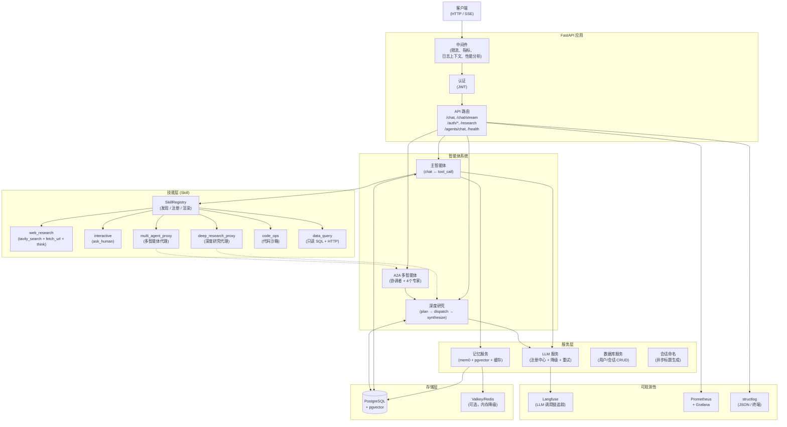
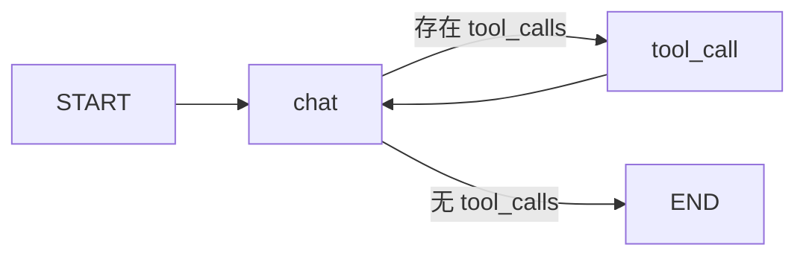
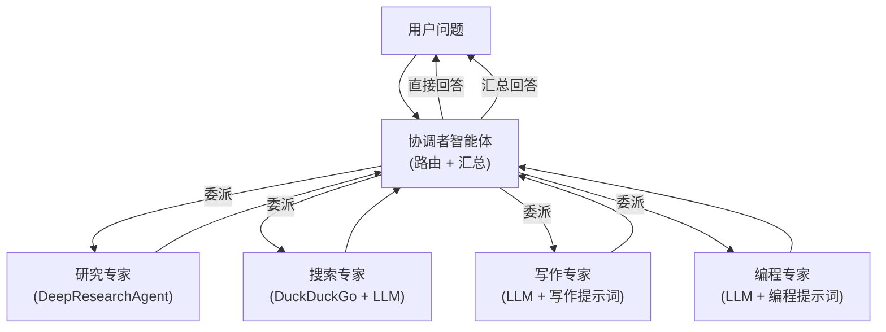
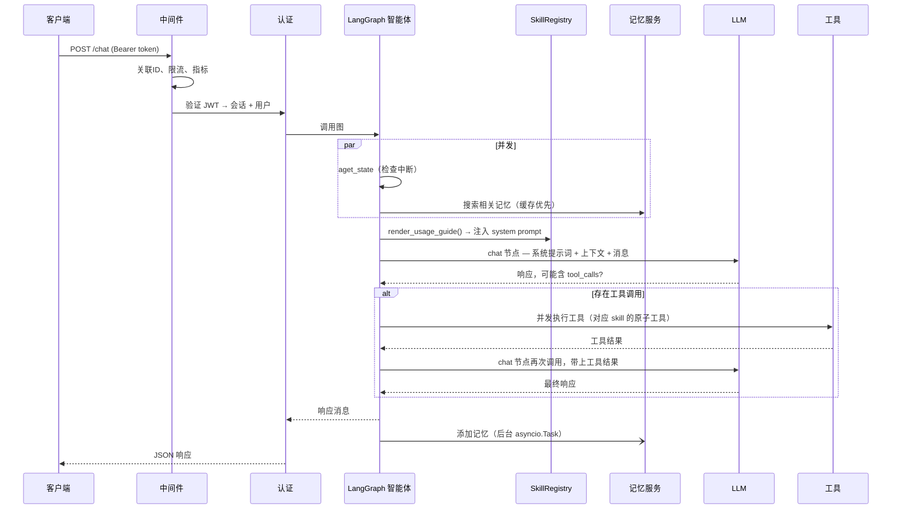

# 架构文档

## 系统总览

## 技能系统（Skill）

Skill 是工具与选择元数据的封装层，让 LLM 知道"何时该用什么工具"。`SkillRegistry` 在启动时自动发现并注册所有 skill，每个 skill 包暴露若干工具。主智能体通过 `SkillRegistry.collect_tools()` 获取扁平化的工具列表绑定到 LLM，同时通过 `SkillRegistry.render_usage_guide()` 将用法指南注入系统提示词。

### 6 个 Skill

| Skill | 层级 | 默认启用 | 启用条件 | 暴露的工具 |
|---|---|---|---|---|
| `web_research` | core | ✅ | 默认 | `tavily_search`, `fetch_url`, `think_tool` |
| `interactive` | core | ✅ | 默认 | `ask_human` |
| `deep_research_proxy` | advanced | ✅ | `ENABLED_SKILLS_TIER=all` | `deep_research` |
| `multi_agent_proxy` | advanced | ✅ | 同上 | `multi_agent_delegate` |
| `code_ops` | core | ❌ | 配置 `CODE_OPS_ALLOWED_ROOTS` | `code_read_file`, `code_list_dir`, `code_grep`, `code_detect_language` |
| `data_query` | core | ❌ | 配置 `DATA_QUERY_READONLY_DSN` 或 `DATA_QUERY_ALLOWED_HOSTS` | `run_sql`, `http_api_call`（按需组合） |

**核心设计**：

- **Skill 是不可变 dataclass**，含 `when_to_use` / `when_not_to_use` / `examples` / `tier` 元数据 + 工具列表，自带 `render_guide()` 方法渲染为系统提示词片段。
- **两阶段注册**：模块加载时各 skill `__init__.py` 调用 `SkillRegistry.register()`；应用 lifespan 调用 `SkillRegistry.discover()` 统一触发。
- **Tier 机制**：`core` 级始终暴露；`advanced` 级（proxy skill）仅在 `ENABLED_SKILLS_TIER=all` 时暴露，节省 prompt token 预算。
- **条件注册**：`code_ops` 和 `data_query` 在未配置时完全不注册，LLM 看不到这些工具。
- **安全沙箱**：`code_ops` 所有路径经 `resolve_inside_root()` 校验，防止 `..`/符号链接逃逸；`data_query` 正则 + 关键字黑名单校验 SQL，主防线为 DB 引擎层只读账号。

## 三大智能体系统

应用内同时运行着三套独立的智能体系统，各自服务于不同的使用场景：

### 1. 主智能体 —— 对话助手 (`app/core/langgraph/graph.py`)

一个两节点的 `StateGraph`，用于多轮对话：

- **`chat` 节点** — 加载系统提示词（含用户名、当前时间、长期记忆、技能用法指南），调用 LLM，返回 `Command` 决定路由到 `tool_call` 还是 `END`。
- **`tool_call` 节点** — 通过 `asyncio.gather` 并发执行所有工具调用，每条调用记录 skill 级别的 Prometheus 指标，结果回传给 `chat`。
- **检查点** — `AsyncPostgresSaver` 将 `GraphState` 按 `thread_id`（每个会话一个）持久化到 PostgreSQL，支持中断恢复和多轮记忆。
- **工具绑定**：启动时通过 `SkillRegistry.collect_tools()` 收集所有已注册 skill 的工具并绑定到 LLM。工具绑定延迟到 `create_graph()` 阶段以确保 `SkillRegistry.discover()` 已完成。

### 2. 深度研究智能体 (`app/core/langgraph/deep_research/`)

三节点编排器，将研究问题拆解为子任务，并发执行后汇总报告：

- **`plan` 节点** — LLM 将问题拆解为 `ResearchPlan`（1~10 个子任务，JSON 输出）。
- **`dispatch` 节点** — 并发运行各子任务的研究子图，受 `RESEARCH_MAX_CONCURRENT_SUBAGENTS` 信号量限制。
- **`synthesize` 节点** — LLM 合并所有发现，输出带去重引用的统一 Markdown 报告。
- **研究员子图** (`researcher.py`) — 每个子任务采用两轮设计：(1) LLM 决定搜索关键词，(2) 通过 Tavily + 网页抓取并发执行搜索，(3) LLM 在全新对话中汇总发现。
- 同时被 `/research` 端点、A2A 研究专家、以及 `deep_research_proxy` skill 调用。

### 3. A2A 多智能体系统 (`app/core/a2a/`)

基于 Google Agent-to-Agent (A2A) 协议的协调者-工作者架构：

- **协调者** (`coordinator.py`) — LLM 驱动的路由器，将用户问题分类为委派任务（或直接回答），并发派发后汇总结果。
- **四个专家** (`specialists.py`) — 每个专家作为独立的 A2A 服务器运行，拥有描述自身能力的 `AgentCard`。
- **A2A 协议** — 使用标准 `a2a-sdk` 类型：`AgentCard`、`RequestContext`、`EventQueue`、`Task` 生命周期。专家通过 `mount_a2a_servers()` 挂载为 FastAPI 子应用。
- 由 `/agents/chat` 端点调用，同时 `multi_agent_proxy` skill 使主智能体也能触发 A2A 协作。

## 请求生命周期

## 关键设计决策

**Skill 封装层实现工具自描述与按需暴露。** 每个 skill 自带 `when_to_use` / `when_not_to_use` / `examples` 元数据，自动渲染注入系统提示词。Tier 机制（core/advanced）控制 prompt 预算；条件注册（code_ops / data_query）确保未配置时 LLM 看不到对应工具。Proxy skill 将 DeepResearchAgent 和 CoordinatorAgent 包装为 LLM 可调用的单个工具，无缝接入主对话链路。

**三大智能体共享服务但独立初始化。** 主智能体、深度研究智能体和 A2A 协调者各自拥有独立的 `AsyncPostgresSaver` 连接池、独立的图和独立的预热流程。一个系统启动失败不会阻止其他系统启动（优雅降级）。

**记忆搜索与状态检查并发执行。** 对每个非恢复请求，`aget_state`（检查中断）和 `memory.search`（获取相关记忆）通过 `asyncio.gather` 并行运行，每次请求节省 200~500ms。记忆搜索优先命中缓存层，未命中时回退到 mem0ai + pgvector。

**工具调用并发执行，每个工具埋点 skill 级指标。** 当 LLM 单次响应返回多个工具调用时，全部通过 `asyncio.gather` 并行执行。每个工具调用在 try/finally 中记录 `skill_invocations_total{skill,tool,status}` 和 `skill_duration_seconds{skill,tool}` 两个 Prometheus 指标。

**系统提示词在模块加载时缓存。** 所有提示词模板（`app/core/prompts/` 下的 `.md` 文件）在启动时一次性读取。每次请求仅需 `.format()` 填入用户名、当前时间、检索到的记忆和 skill 用法指南 — 无文件 I/O。

**LLM 降级有时间上限且为循环切换。** `LLMService` 在注册的模型之间循环切换（默认：`deepseek-v4-flash` → `deepseek-v4-pro`），每个模型有独立的重试预算。整个降级循环包裹在 `asyncio.wait_for(timeout=LLM_TOTAL_TIMEOUT)` 中，防止无限挂起。通过 `tenacity` 对限流、超时和 API 错误进行指数退避重试。

**用户名随会话传递，不每次查库。** 用户的显示名在会话创建时复制到 `Session.username`。聊天请求直接从已加载的会话对象中读取 — 零额外查询。

**会话标题零延迟生成。** 在未命名会话的首条消息时，API 原子性地抢占会话并写入占位标题（用户消息的截断版），然后触发后台 `asyncio.Task` 调用快速小模型按结构化输出生成正式标题。主聊天响应立即返回 — 标题生成并行进行。PostgreSQL 中的 `UPDATE … WHERE name = ''` 原子操作确保并发请求下只有一个工作者胜出。

**深度研究采用两轮子智能体设计。** 每个研究子任务分为两次独立的 LLM 调用：一次规划搜索策略，一次汇总发现。这避免了在单轮对话中多次工具调用导致 `reasoning_content` 累积的问题。

**A2A 专家是独立的服务器。** 每个专家作为独立的 FastAPI 子应用挂载，拥有自己的 `DefaultRequestHandler`、`AgentExecutor` 和 `InMemoryTaskStore`。协调者通过标准 A2A SDK 客户端和共享的 `httpx.AsyncClient` 与之通信。

**生产环境下优雅降级。** 在 `lifespan` 启动过程中，图构建、连接池、缓存、skill 发现和记忆服务的失败会被捕获并记录，不会导致应用崩溃。在开发/预发布环境中，这些失败会立即抛出以便快速发现问题。

**输入在边界处净化。** 所有用户输入的字符串在请求 Schema 的 Pydantic 校验器中通过 `sanitize_string()`（HTML 转义、移除 script 标签、去除空字节）进行净化。

## 组件职责

| 组件 | 文件 | 职责 |
|---|---|---|
| **FastAPI 应用** | `app/main.py` | 生命周期管理（预热/关闭）、中间件栈、路由挂载、skill 发现 |
| **配置** | `app/core/config.py` | 从环境变量和 `.env` 文件读取环境感知配置，含 skill/code_ops/data_query 配置项 |
| **Skill 注册中心** | `app/core/langgraph/skills/registry.py` | Skill 发现、注册、Tier 过滤、工具收集、用法指南渲染 |
| **Skill 基类** | `app/core/langgraph/skills/base.py` | Skill 不可变 dataclass，含元数据 + 工具列表 + render_guide() |
| **主智能体** | `app/core/langgraph/graph.py` | 两节点对话智能体，通过 SkillRegistry 绑定工具，支持检查点持久化 |
| **深度研究智能体** | `app/core/langgraph/deep_research/` | 多步研究：规划 → 并发派发 → 汇总 |
| **A2A 协调者** | `app/core/a2a/coordinator.py` | 将问题路由到专家，汇总结果 |
| **A2A 专家** | `app/core/a2a/specialists.py` | 研究、搜索、写作、编程 — 每个都是独立的 A2A 服务器 |
| **A2A 服务器/客户端** | `app/core/a2a/server.py`, `client.py` | A2A 协议集成（AgentCard、Task 生命周期、HTTP 传输） |
| **LLM 注册中心** | `app/services/llm/registry.py` | 模型目录，支持懒加载和循环切换 |
| **LLM 服务** | `app/services/llm/service.py` | 工具绑定、重试（tenacity）、降级循环、总超时、结构化输出 |
| **记忆服务** | `app/services/memory.py` | mem0ai 语义记忆，使用 DashScope 嵌入、pgvector 存储、缓存层 |
| **数据库服务** | `app/services/database.py` | 异步用户/会话 CRUD（SQLModel）、健康检查 |
| **会话命名** | `app/services/session_naming.py` | 后台 LLM 标题生成，采用原子抢占模式 |
| **缓存** | `app/core/cache.py` | Valkey/Redis 带 TTL，自动降级到内存字典 |
| **提示词** | `app/core/prompts/` | 所有系统提示词在模块加载时读取，含 `{tool_usage_guide}` 占位符 |
| **中间件** | `app/core/middleware.py` | 指标记录、日志上下文绑定（JWT → session_id）、性能分析（DEBUG） |
| **限流** | `app/core/limiter.py` | slowapi，可选 Redis 分布式后端 |
| **指标** | `app/core/metrics.py` | Prometheus 计数器/直方图：HTTP、LLM、数据库、会话命名、skill 调用 |
| **可观测性** | `app/core/observability.py` | Langfuse 客户端初始化和 LangChain 回调处理器 |
| **日志** | `app/core/logging.py` | structlog + 上下文变量、JSONL 文件输出、终端渲染（开发环境） |
| **认证端点** | `app/api/v1/auth.py` | JWT 创建、会话管理、用户注册/登录 |
| **聊天端点** | `app/api/v1/chatbot.py` | 聊天 + SSE 流式、聊天历史、消息清除 |
| **研究端点** | `app/api/v1/research.py` | 深度研究触发，生成唯一 thread_id |
| **多智能体端点** | `app/api/v1/agents.py` | 多智能体协调者聊天 |
| **原子工具** | `app/core/langgraph/tools/` | Tavily 搜索（含全文抓取）、fetch_url、think_tool、ask_human |
| **图工具函数** | `app/utils/graph.py` | 消息预处理、Token 计数、内容提取 |
| **输入净化** | `app/utils/sanitization.py` | 输入净化（HTML 转义、script 标签移除、空字节去除） |
| **JWT 工具** | `app/utils/auth.py` | Token 创建（sub/sid/jti 声明）、Token 验证 |
| **ORM 模型** | `app/models/` | User、Session、Thread（SQLModel） |
| **Schema** | `app/schemas/` | 请求/响应 Pydantic 模型、GraphState、深度研究状态、多智能体状态 |
| **评估** | `evals/` | 基于 Langfuse 的指标评估 + skill_routing 路由准确率评估 |
| **code_ops 沙箱** | `app/core/langgraph/skills/code_ops/` | 路径安全校验、二进制检测、跳过目录过滤、asyncio.to_thread I/O |
| **data_query 校验** | `app/core/langgraph/skills/data_query/safety.py` | SQL 只读校验（正则前缀+黑名单）、HTTP host 白名单校验 |

## 存储层

| 存储 | 技术 | 用途 |
|---|---|---|
| **对话状态** | PostgreSQL（LangGraph `AsyncPostgresSaver`） | 按 thread 持久化完整 `GraphState`，支持多轮对话和中断/恢复 |
| **长期记忆** | PostgreSQL + pgvector（mem0ai） | 按用户的语义记忆，含向量嵌入 |
| **用户数据** | PostgreSQL（SQLModel） | 用户、会话（含自动生成标题）、线程 |
| **缓存** | Valkey/Redis → 内存字典降级 | 记忆搜索结果、通用缓存 |
| **LLM 调用链** | Langfuse 云/自托管 | 每次 LLM 调用的完整追踪（提示词、响应、Token、成本、延迟） |

## 可观测性栈

- **Langfuse** — 通过 LangChain 的 `CallbackHandler` 追踪所有 LLM 调用。也是评估框架的数据来源。
- **Prometheus + Grafana** — HTTP 请求指标（计数、耗时）、LLM 推理/流式耗时直方图、skill 调用次数/耗时（`skill_invocations_total`、`skill_duration_seconds`）、数据库连接数仪表、会话命名计数器。预置 LLM 延迟仪表盘。
- **structlog** — 结构化日志，绑定上下文（request_id、session_id、user_id）。开发环境终端输出，生产环境 JSON 输出。每日 JSONL 文件用于审计。Skill 调用有专用事件名（`code_read_file_invoked`、`data_query_run_sql_invoked` 等）。
- **性能分析**（仅 DEBUG 模式）— 请求耗时超过阈值时，将 `pyinstrument` 火焰图 + `tracemalloc` 快照保存到磁盘。
- **Skill 路由评估**（`evals/skill_routing/`）— 离线评估 LLM 的 skill 选择准确率，含 18 条标注集，可作为 CI gate（accuracy ≥ 70%）。
