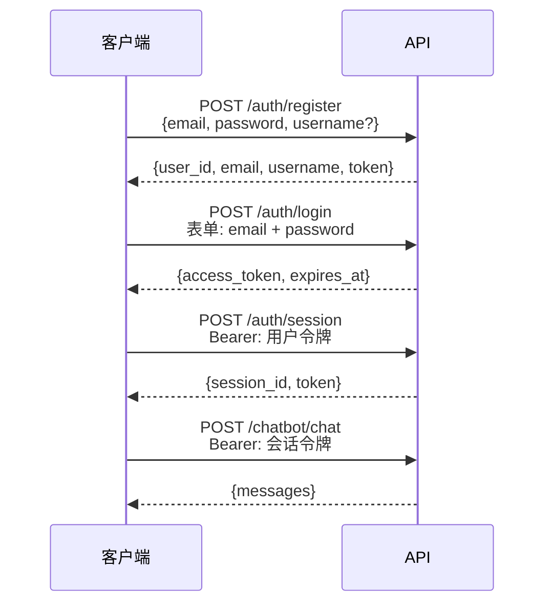

# 认证

## 流程



API 使用**两种令牌作用域**：

- **用户令牌（User token）** — 注册/登录时签发，标识用户身份。用于创建和列出会话。
- **会话令牌（Session token）** — 每个对话会话签发一个。所有聊天端点均需携带。作用域限定为单个 `session_id`。

两者均为签名的 JWT（HS256），过期时间可通过 `JWT_ACCESS_TOKEN_EXPIRE_DAYS` 配置。

---

## 端点

### `POST /api/v1/auth/register`

创建新账号。

```json
{
  "email": "you@example.com",
  "password": "Secret123!",  // pragma: allowlist secret
  "username": "you"
}
```

密码要求：至少 8 位，含大写字母、小写字母、数字、特殊字符。

`username` 可选。提供后会传入智能体的系统提示词，让 LLM 知晓用户的名字。

---

### `POST /api/v1/auth/login`

用凭证换取用户令牌。使用 OAuth2 密码授权表单字段。

```bash
curl -X POST /api/v1/auth/login \
  -F "email=you@example.com" \
  -F "password=Secret123!" \
  -F "grant_type=password"
```

返回 `access_token` 和 `expires_at`。

---

### `POST /api/v1/auth/session`

创建新的聊天会话。需要有效的用户令牌。

```bash
curl -X POST /api/v1/auth/session \
  -H "Authorization: Bearer <用户令牌>"
```

返回 `session_id` 和会话作用域的 `token`。后续所有聊天请求均使用此会话令牌。

---

### `PATCH /api/v1/auth/session/{session_id}/name`

重命名会话。

```bash
curl -X PATCH /api/v1/auth/session/{session_id}/name \
  -H "Authorization: Bearer <会话令牌>" \
  -F "name=我的研究会话"
```

---

### `DELETE /api/v1/auth/session/{session_id}`

删除会话及其聊天历史。

---

### `GET /api/v1/auth/sessions`

列出当前用户的所有会话。需要用户令牌。

---

## 安全说明

- 密码在存储前使用 bcrypt 哈希 — 明文永不落盘。
- JWT 包含 `jti`（JWT ID）声明以确保令牌唯一性，以及 `sub`（用户 ID）和 `sid`（会话 ID）声明。
- 所有字符串输入在使用前均经过净化处理。
- 限流保护注册（每小时 10 次）和登录（每分钟 20 次）端点，防范暴力破解。
- 生产环境中请设置足够长的随机 `JWT_SECRET_KEY` — 至少 32 个字符。
