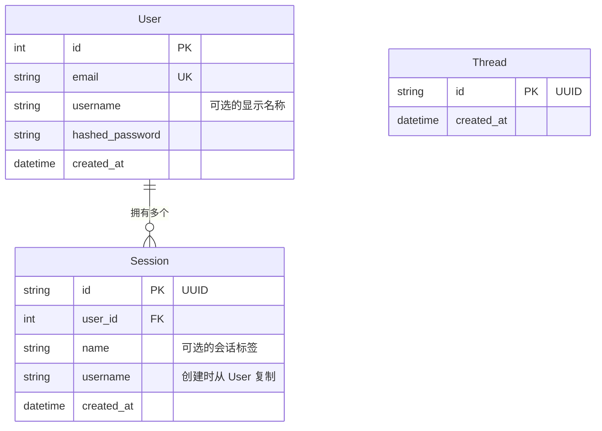

# 数据库与迁移

## Schema



**User** — 每个账号一条记录。Email 唯一。`username` 可选，用于个性化系统提示词。

**Session** — 每个对话一条记录。一个用户可拥有多个会话。`username` 在创建时从 `User` 冗余复制，使聊天请求无需额外查询数据库。会话 JWT 限定所有聊天请求的作用域。

**Thread** — 对应 LangGraph `AsyncPostgresSaver` 的检查点线程。追踪应用上下文中的线程存在情况。

LangGraph 检查点机制还会创建自己的表（`checkpoints`、`checkpoint_blobs`、`checkpoint_writes`）— 这些由 LangGraph 自身管理，不归 Alembic 管辖。

pgvector 会创建 `longterm_memory` 集合表，由 mem0 管理 — 同样不归 Alembic 管辖。

---

## 使用 Alembic 进行迁移

所有 Schema 变更通过 Alembic 管理。应用不再在启动时调用 `create_all()` — Schema 完全由 Alembic 掌控。

### 初次设置（全新数据库）

```bash
make migrate              # 将所有迁移应用到数据库
```

### 模型变更后创建迁移

```bash
# 1. 编辑 SQLModel 模型（app/models/）
# 2. 生成迁移文件
make migration MSG="add phone number to user"

# 3. 检查 alembic/versions/ 中生成的文件
# 4. 应用迁移
make migrate
```

### 其他命令

```bash
make migrate-downgrade    # 回滚最近一次迁移
make migrate-history      # 查看完整迁移历史
```

Alembic 从 `.env` 文件（通过 `app/core/config.py`）读取数据库连接信息。运行迁移前请确保 `APP_ENV` 设置正确。

### 自动生成原理

`env.py` 导入所有 SQLModel 模型以注册其元数据，然后调用 `alembic revision --autogenerate`。Alembic 对比当前数据库 Schema 与模型定义，自动生成升级/降级函数。

外部表（LangGraph 检查点、mem0、pgvector）通过 `alembic/env.py` 中的 `include_object` 排除，Alembic 绝不会触碰它们。

### 添加新模型

1. 创建 `app/models/your_model.py`
2. 在 `alembic/env.py` 中导入，与现有模型导入并列
3. 运行 `make migration MSG="add your_model table"`

---

## 为全新数据库启用 pgvector

运行迁移前必须先启用 pgvector 扩展：

```sql
CREATE EXTENSION IF NOT EXISTS vector;
```

使用 Docker（`make docker-up`）时，`db` 服务会自动处理。对于外部数据库（如 Supabase），请通过控制台或 SQL 编辑器手动启用扩展。
