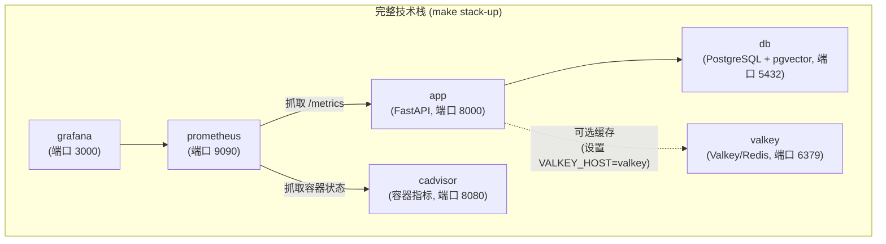

# Docker

## 服务



Valkey 始终启动，但仅当 `.env` 中设置了 `VALKEY_HOST=valkey` 时应用才会使用。未设置时应用降级使用内存缓存。

## 命令

### API + 数据库（最常用的开发模式）

```bash
make docker-up ENV=development     # 启动
make docker-down ENV=development   # 停止
make docker-logs ENV=development   # 查看日志
```

### 完整技术栈（含 Prometheus + Grafana）

```bash
make stack-up ENV=development      # 启动全部服务
make stack-down ENV=development    # 停止全部服务
make stack-logs ENV=development    # 查看所有服务日志
```

### 构建自定义镜像

```bash
make docker-build ENV=production
```

此命令运行 `scripts/build-docker.sh`，为指定环境构建并打标签。

## 在 Docker 中运行迁移

执行 `make docker-up` 后，对容器化数据库运行迁移：

```bash
make migrate ENV=development
```

这会加载对应的 `.env` 文件，从本机运行 `alembic upgrade head`，连接到容器化的 PostgreSQL。

## 环境文件

每个环境需要对应的 `.env.<env>` 文件：

```bash
cp .env.example .env.development
cp .env.example .env.staging
cp .env.example .env.production
```

`docker-up` 和 `stack-up` 命令通过 `--env-file` 将环境文件传递给 Docker Compose。请确保 Docker 环境文件中 `POSTGRES_HOST=db`（而非 `localhost`）— Compose 网络内服务名是 `db`。

## Grafana

`make stack-up` 后，Grafana 可在 [http://localhost:3000](http://localhost:3000) 访问。

默认凭证：`admin` / `admin`

预配置仪表盘（位于 `grafana/`）：

- API 性能（请求速率、延迟、错误率）
- 限流统计
- 数据库连接池健康状态
- 系统资源使用
