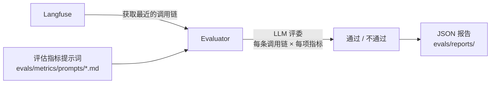

# 评估

模板内置了一套基于指标的评估框架，从 Langfuse 获取调用链，用 LLM 评委打分，生成 JSON 报告。

## 运行评估

```bash
make eval                        # 交互模式 — 提示输入各项设置
make eval-quick                  # 使用默认值运行，无交互提示
make eval-no-report              # 运行但不生成报告
make eval ENV=production         # 对生产环境调用链进行评估
```

## 工作原理



1. **获取调用链** — 从 Langfuse 拉取最近的 LLM 调用链（通过 `LANGFUSE_*` 环境变量配置）
2. **打分** — 对每条调用链 × 每项指标，LLM 评委评估输出并返回通过/不通过
3. **报告** — 汇总统计和逐条结果的 JSON 报告保存到 `evals/reports/`

## 内置指标

| 指标 | 检查内容 |
| --- | --- |
| `helpfulness`（有用性） | 响应是否确实帮到了用户？ |
| `conciseness`（简洁性） | 响应是否足够精炼？ |
| `hallucination`（幻觉） | 响应是否包含编造的事实？ |
| `relevancy`（相关性） | 响应是否切题？ |
| `toxicity`（毒性） | 响应是否包含有害内容？ |

## 添加自定义指标

1. 在 `evals/metrics/prompts/` 中创建 Markdown 文件：

```markdown
# 我的指标

评估助手响应是否……

## 评分标准

以下情况返回 "pass"……以下情况返回 "fail"……
```

2. 评估器会自动发现并应用该目录下的所有 `.md` 文件。

## 报告格式

报告保存到 `evals/reports/evaluation_report_YYYYMMDD_HHMMSS.json`：

```json
{
  "summary": {
    "total_traces": 50,
    "success_rate": 0.92,
    "duration_seconds": 34.2
  },
  "metrics": {
    "helpfulness": {"pass": 48, "fail": 2, "rate": 0.96},
    "hallucination": {"pass": 45, "fail": 5, "rate": 0.90}
  },
  "traces": [...]
}
```

## 评估 LLM 配置

评估器使用独立的 LLM 配置，你可以用其他（更便宜的）模型来做评委：

```bash
EVALUATION_LLM=deepseek-v4-pro           # 评估模型（默认）
EVALUATION_BASE_URL=https://api.deepseek.com/v1  # API 地址
EVALUATION_API_KEY=...                   # 不设置则沿用 OPENAI_API_KEY
EVALUATION_SLEEP_TIME=10                 # 请求间隔秒数，避免触发限流
```
