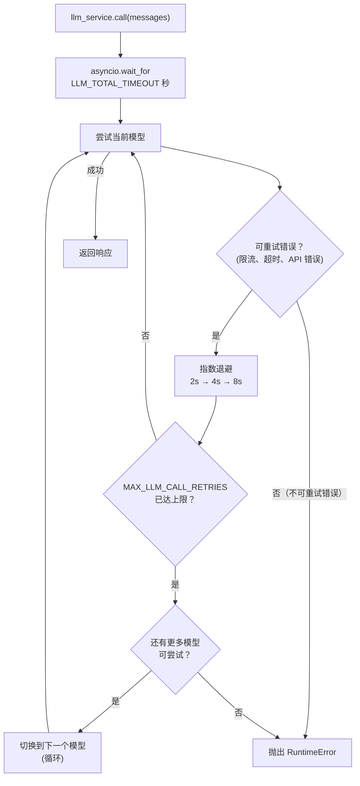

# LLM 服务

## 概述

LLM 服务（`app/services/llm/`）处理所有语言模型调用，提供自动重试、循环模型降级和总超时预算。你的智能体代码只需调用 `llm_service.call(messages)` — 其余全由服务层处理。

该包拆分为两个模块：

- `app/services/llm/registry.py` — `LLMRegistry`：定义可用模型
- `app/services/llm/service.py` — `LLMService`：调用逻辑、重试、降级、结构化输出

## 模型注册中心

模型按优先级顺序定义在 `LLMRegistry.LLMS` 中：

| 名称 | 对应模型 | 说明 |
| -------------- | ------------ | -------------------------------------- |
| `deepseek-v4-flash` | deepseek-v4-flash | 默认模型，快速低成本 |
| `deepseek-v4-pro` | deepseek-v4-pro | 更强推理能力，降级备选 |

在 `.env` 中设置 `DEFAULT_LLM_MODEL` 来选择起始模型。

如需添加或更换模型，编辑 `app/services/llm/registry.py` 中的 `LLMRegistry.LLMS` 列表。

## 重试与降级行为



**重试配置**（每个模型独立）：

- 最大尝试次数：`MAX_LLM_CALL_RETRIES`（默认：3）
- 等待策略：指数退避，最小 2s，最大 10s
- 重试范围：`RateLimitError`、`APITimeoutError`、`APIError`

**总超时**：`LLM_TOTAL_TIMEOUT` 秒（默认：180s）为整个循环设上限。没有这个限制，最坏情况是 `重试次数 × 模型数 × 最大等待` — 可能超过 2 分钟。

**降级顺序**：在 `LLMRegistry.LLMS` 中循环。用完最后一个模型后绕回第一个，完成一个完整循环后停止。

## 工具

工具在启动时绑定到 LLM：

```python
llm_service.bind_tools(tools)
```

降级切换模型时，工具会自动重新绑定到新模型。

## 结构化输出

传入 Pydantic 模型作为 `response_format`，即可获取验证后的实例，而非原始的 `BaseMessage`：

```python
from app.schemas.my_schema import MySchema

result: MySchema = await llm_service.call(
    messages,
    model_name="deepseek-v4-flash",  # 可选 — 不传则用当前默认模型
    response_format=MySchema,
    temperature=0.2,
)
```

服务层在模型上链式调用 `.with_structured_output(schema)`，并在每次降级尝试时重新包装，因此重试和模型切换均透明无感。

## 添加新模型

```python
# app/services/llm/registry.py — LLMRegistry.LLMS
{
    "name": "deepseek-v4-pro",
    "llm": ChatOpenAI(
        model="deepseek-v4-pro",
        api_key=_API_KEY,
        base_url=_BASE_URL,
        max_completion_tokens=_MAX_TOKENS,
    ),
},
```

添加到列表中的任意位置。降级顺序按列表顺序执行。

## 两种调用路径

`LLMService.call()` 根据参数自动选择路径：

- **默认路径**（不传 `model_name` / `response_format` / `model_kwargs`）：使用绑定了工具的共享 `self._llm` 实例，降级时自动重新绑定工具。适合有状态的 Agent 对话。
- **一次性路径**（传入任意 override 参数）：每次创建新的本地实例，不影响当前默认模型的状态。适合需要不同 `response_format` 或 temperature 的独立任务。
