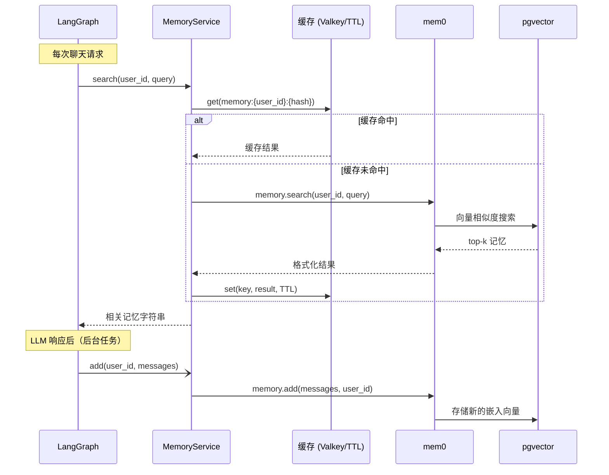

# 记忆

## 概述

模板内置了基于 [mem0](https://github.com/mem0ai/mem0) 和 pgvector 的长期记忆系统。记忆从对话中提取，存储为向量嵌入，并在每次请求时进行语义检索 — 让智能体能利用过往会话的上下文。

## 工作原理

## 缓存层

记忆搜索结果会被缓存，避免在同一 TTL 窗口内对相似问题的重复 pgvector 查询。

- **有 Valkey/Redis**：缓存在所有应用实例间共享。在 `.env` 中设置 `VALKEY_HOST`。
- **无 Valkey**：降级为内存 `TTLCache` — 单实例运行完全够用。

缓存键：`memory:{user_id}:{sha256(query)[:16]}`
TTL：`CACHE_TTL_SECONDS`（默认：60s）

仅缓存成功且非空的结果。错误绝不缓存。

## 记忆更新

LLM 生成响应后，记忆更新通过 `asyncio.create_task` **在后台**执行。这意味着：
- 响应立即返回，不等待 mem0 完成
- 记忆更新不会阻塞或拖慢聊天响应

## 配置

| 变量 | 默认值 | 说明 |
| --- | --- | --- |
| `DASHSCOPE_API_KEY` | — | DashScope API 密钥（mem0ai 使用 text-embedding-v4 依赖此项） |
| `LONG_TERM_MEMORY_COLLECTION_NAME` | `longterm_memory` | pgvector 集合名称 |
| `LONG_TERM_MEMORY_MODEL` | `deepseek-v4-flash` | mem0 用于提取和处理记忆的 LLM |
| `LONG_TERM_MEMORY_EMBEDDER_MODEL` | `text-embedding-v4` | 语义搜索的嵌入模型（阿里云 DashScope） |
| `CACHE_TTL_SECONDS` | `60` | 记忆搜索缓存 TTL |

## 启动预热

启动时，`memory_service.initialize()` 会在应用生命周期中被调用。这会建立 pgvector 连接池并运行 mem0 的 Schema 检查，避免首个用户请求承担约 130ms 的冷启动代价。

## 用户隔离

每个用户的记忆通过 `user_id` 作为命名空间独立存储和搜索。用户之间无法互相访问记忆。
