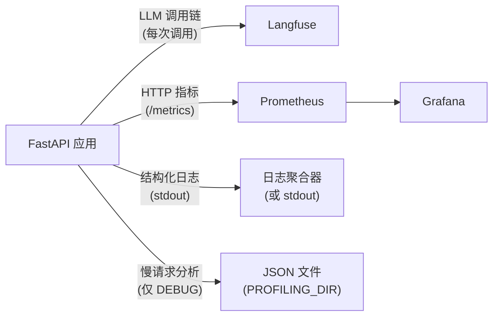

# 可观测性

## 概述



---

## Langfuse —— LLM 调用链追踪

每次 LLM 调用均通过 LangChain 的 `CallbackHandler` 进行追踪。调用链包含：

- 输入消息和输出内容
- Token 用量和成本
- 每次调用和每个会话的延迟
- 模型名称、temperature 及其他参数

**配置：**

```bash
LANGFUSE_TRACING_ENABLED=true
LANGFUSE_PUBLIC_KEY=pk-...
LANGFUSE_SECRET_KEY=sk-...
LANGFUSE_HOST=https://cloud.langfuse.com   # 或自托管地址
```

**本地开发时禁用：**

```bash
LANGFUSE_TRACING_ENABLED=false
```

调用链也是[评估框架](evaluation.md)的数据来源。

---

## 结构化日志

所有日志使用 [structlog](https://www.structlog.org/) 统一格式：

- **开发环境**：彩色终端输出
- **生产环境**：JSON（可接入日志聚合器）

每条日志自动携带 `request_id`、`session_id` 和 `user_id`（当可用时）— 由 `LoggingContextMiddleware` 绑定。

### 日志格式规范

```python
# 正确做法
logger.info("chat_request_received", session_id=session.id, message_count=5)

# 禁止做法
logger.info(f"chat request received for {session.id}")  # 禁止使用 f-string
logger.error("something failed", error=str(e))           # 异常请用 logger.exception
```

规则：

- 事件名使用 `lowercase_with_underscores` 格式
- 变量作为关键字参数传入，绝不拼入事件字符串
- 在 `except` 块中使用 `logger.exception()`（而非 `.error()`）— 保留完整调用栈

### 各环境日志级别

| 环境 | 级别 |
| --- | --- |
| development | DEBUG |
| staging | INFO |
| production | WARNING |

---

## Prometheus 指标

指标暴露在 `GET /metrics` 端点，由 Prometheus 抓取。

| 指标 | 类型 | 说明 |
| --- | --- | --- |
| `starlette_requests` | Counter | 按 method、path_template 统计的请求总数 |
| `starlette_responses` | Counter | 按 method、path_template、status_code 统计的响应数 |
| `starlette_requests_in_progress` | Gauge | 正在处理的请求数 |
| `starlette_requests_processing_time_seconds` | Histogram | 按 method、path_template 统计的请求处理延迟 |
| `starlette_exceptions` | Counter | 按 method、path_template、exception_type 统计的异常数 |
| `llm_inference_duration_seconds` | Histogram | 按模型统计的 LLM 调用延迟 |

Grafana 仪表盘预配置在 `grafana/` 中。运行 `make stack-up ENV=development` 启动完整技术栈后，访问 [http://localhost:3000](http://localhost:3000)（admin/admin）。

---

## 请求性能分析（仅 DEBUG 模式）

当 `DEBUG=true` 时，`ProfilingMiddleware` 使用 [pyinstrument](https://github.com/joerick/pyinstrument) 对每个请求进行性能分析。当请求耗时超过 `PROFILING_THRESHOLD_SECONDS` 时，JSON 报告保存到 `PROFILING_DIR`。

每个报告文件以 `{request_id}.json` 命名，内容如下：

```json
{
  "request_id": "...",
  "endpoint": "POST /api/v1/chat",
  "wall_time_ms": 1842,
  "cpu_time_ms": 145,
  "io_wait_ms": 1697,
  "memory_peak_kb": 4820,
  "top_memory_allocators": [...],
  "call_tree": {...}
}
```

设置 `PROFILING_THRESHOLD_SECONDS=0` 可对每个请求都进行采样。

文件名中的 `request_id` 与响应头 `X-Request-ID` 一致，便于将性能分析与具体日志行进行关联。

---

## 请求 ID 传播

每个请求通过 [`asgi-correlation-id`](https://github.com/snok/asgi-correlation-id) 获取唯一的 `X-Request-ID` 头。该 ID：

- 在响应头中返回
- 绑定到该请求的每一条日志
- 用作性能分析报告的文件名

使用响应中的 `X-Request-ID`，即可在日志中 grep、查找性能分析文件、以及在 Langfuse 中定位对应请求的调用链。
